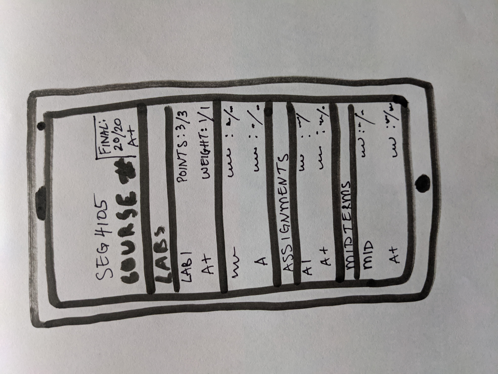

# LAB 4

Working with Brightspace over the years has been a bit of a struggle but one of the features I have missed on the mobile application is the ability to view grades within the app. Currently, the user is redirected to the browser to view all grades and see the final grade for a course. It would be helpful to display all that information within the application itself. The browser version of the grades section is not as user-friendly to view on a mobile device. I also believe that splitting the grades into different sections for the type of grade - like labs or projects or exams - would be beneficial as well as it provides for greater organization and visuals.