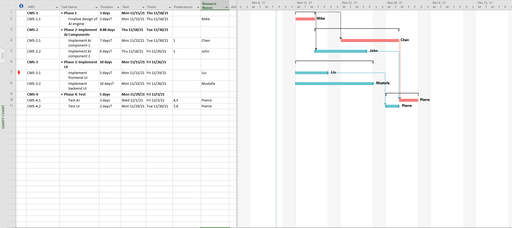
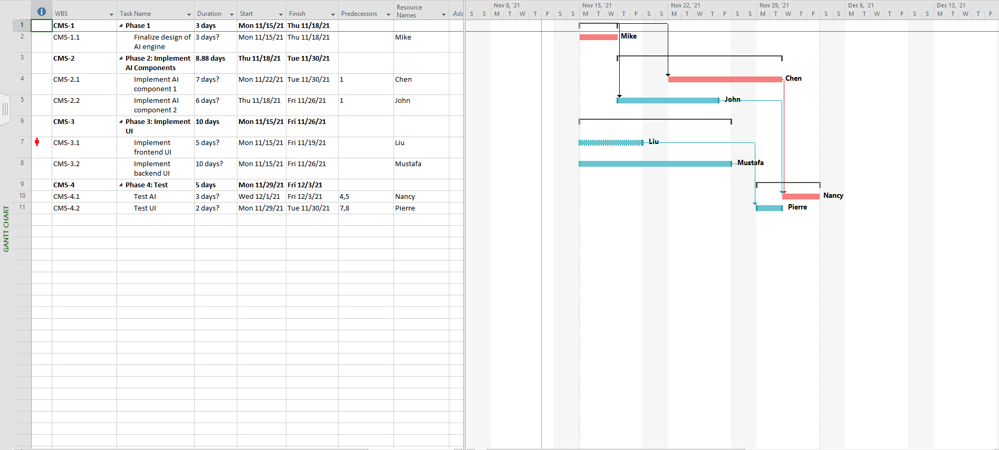

# Lab 8

A. lab08a.mpp

B. Figure B Snapshot: 

C. The estimated cost is $5360.00

D. lab08d.mpp

E. Figure E Snapshot: 

F. There is a resource allocation problem

    F1. Since Pierre was assigned an additional task, he has been allocated more time than he has to complete his work. He is expected to work on multiple tasks simultaneously, which is not humanly feasible.

    F2. This problem can be solved by applying the `Level Resource` function is Microsoft project.

    F3. lab08f.mpp

    F4. Figure F Snapshot:

    
    F5. In figure_e Pierre's schedule is conflicting as he is expected to be working on 2 tasks at the same time. Where as in figure_f he will be working on CMS-4.1 after he finishes with CMS-4.2.

G. The entire project can be delivered in this iteration as it takes exactly 3 calendar-weeks to complete as 4 phases.